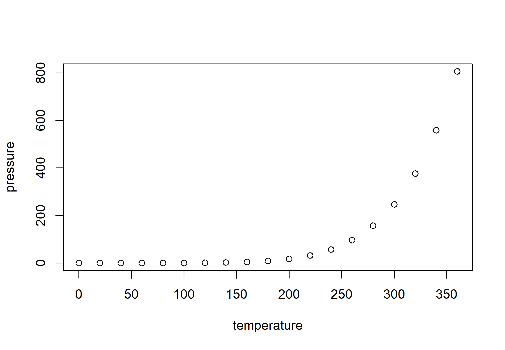

# PAPER TITLE

# Introduction
Here we provide the data and code for:  [**PAPER TITLE**](https://github.com/mathewhauer/paper_template/blob/master/MANUSCRIPT/manuscript.pdf)

### Citation

> Hauer, M.E. & Scientist 2. *Great Journal* (DOI Forthcoming) (YEAR ACCESSED).

# Abstract
> Lorem Ipsum

**Figure Title.** Description of Figure.

To see all of the underlying code and the results, [click here](http://htmlpreview.github.io/?https://github.com/mathewhauer/paper_template/blob/master/MANUSCRIPT/reproduce.html)

# Organization
- `/R/SCRIPTS/`  — Scripts and output for figures included in the main document.
- `/R/DATA-RAW/`  — Initial data resources, unprocessed.
- `/R/DATA-PROCESSED/` — Post-processed data for our analysis.
- `/MANUSCRIPT/manuscript.Rmd` — contains a replication of the manuscript file

- `/MANUSCRIPT/reproduce.Rmd` — contains a replication for underlying estimates.

# Use
- Feel free to create a new branch for further incorporation and analysis. 

# Correspondence
For any issues with the functionality of these scripts please [create an issue](https://github.com/mathewhauer/paper_template/issues).

## License
The data collected and presented is licensed under the [Creative Commons Attribution 3.0 license](http://creativecommons.org/licenses/by/3.0/us/deed.en_US), and the underlying code used to format, analyze and display that content is licensed under the [MIT license](http://opensource.org/licenses/mit-license.php).